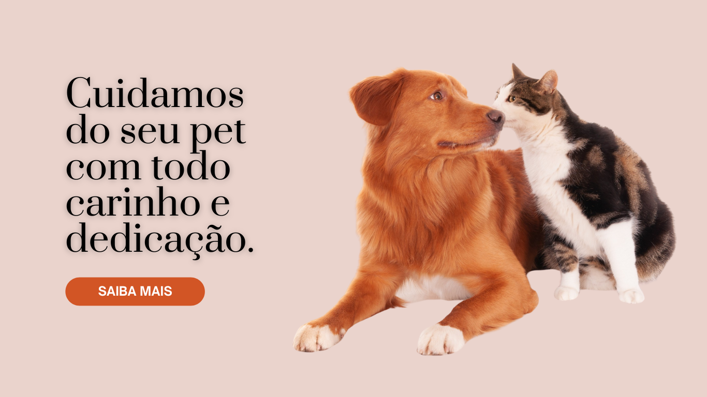

# Petshop Institutional Site

## 🌐 Read the README in Portuguese

If you prefer to read the README in Portuguese, [click here](README-pt.md).


## 🛠️ About the Project



> This project is a modern application that solves the problem of providing a professional and user-friendly online presence for pet shops. It uses React and Node.js as core technologies and provides a scalable solution for pet shop owners to showcase their services, products, and values. The focus is on delivering an engaging website experience that helps customers learn about the pet shop.

---
## 🎯 Motivation

The motivation behind this project is to create an accessible and informative online platform for pet shop owners and pet lovers. The main goal is to improve the customer experience by providing a well-structured, easy-to-navigate website that allows users to quickly find information about services and contact details. This project aims to impact pet owners, helping them find trusted pet care services and products in a digital format.

---
## 🟢 Project Status

This project is in progress.

The project is still under development and the next updates will focus on the following tasks:

- [x] Figma design
- [x] Initial website design and layout
- [x] Hero section
- [x] About section
- [x] Contact section
- [x] Service section
- [x] About page
- [x] Contact page
- [x] Service page
- [ ] Custumer Feedback

---

## 🧰 Technologies Used

This project uses the following technologies:

- **Frontend**: React.js, HTML5, CSS3, Tailwind CSS
- **Backend**: Node.js, Express.js

---

## ⚙️ Installation

### 🖥️ Prerequisites

Make sure you have the following items installed in your environment:

- [Node.js](https://nodejs.org) (version 12 or higher)

### 🔧 Installation on macOS/Linux

```bash
git clone https://github.com/acaf02/petshop-institutional-site.git
cd petshop
yarn install

```

### 💻 Installation on Windows

```bash
git clone https://github.com/acaf02/petshop-institutional-site.git
cd petshop
npm install

```

## 🚀 Usage

This project provides essential features such as viewing the services offered by the petshop, contact details, and additional information about the establishment. Below are the basic steps to get started with the project:

Once you have installed the project, you can run it with the following command:
```bash
npm run dev

```
This will start the server and open the application in your browser at the URL: http://localhost:5173

## 🤝 Contributions

Contributions are always welcome! To contribute, follow these steps:

Fork this repository.<br>
Create a branch for your feature `git checkout -b feature-name`.<br>
Make the necessary changes.<br>
Make a commit with a clear and concise message `git commit -m 'Add new feature'`.<br>
Push to your fork `git push origin feature-name`.<br>
Open a pull request to the original repository.<br>

🔄 Before contributing, make sure the code is working properly. Run tests or review the code to ensure quality!

## 📜 License

This project is under the MIT License. See the [LICENSE](LICENSE) file for more details.

### ⭐ Did you like the project? Leave a star to help the community!
